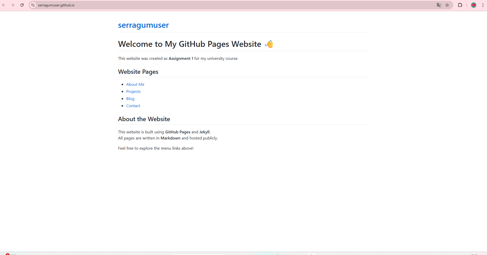

# My GitHub Pages Website  
### Assignment 2 – Reveal.js Presentation

**Student:** Serra  
**Course:** Internet Technologies  

Website URL:  
`https://serragumuser.github.io/`

Note:
These slides describe the GitHub Pages website created in Assignment 1 and how it was built.

---

## Goals of My Website

- Create a public website using **GitHub Pages** and **Jekyll**
- Practice **Markdown** and basic web development
- Organize my content into multiple pages:
  - Home
  - About Me
  - Projects
  - Blog
  - Contact

**Main focus:**  
Learning static site generation and publishing workflow with Git.

---

## Technology Stack

- **GitHub Pages** – hosting
- **Jekyll** – static generator inside GitHub Pages
- **Markdown** – used for all pages
- **Git & GitHub** – version control

**Repository:**  
`https://github.com/serragumuser/serragumuser.github.io`

----

### Site Structure

- `index.md` → Home page  
- `about.md` → About Me  
- `projects.md` → Projects  
- `blog.md` → Blog  
- `contact.md` → Contacts  

---

## Home Page Overview

This page introduces the website and provides navigation links.

----

## About Me Page

Describes who I am and what I am learning.

----

## Blog Page

Contains example learning posts.

----

## Projects Page

Lists my small projects.

----

## Contact Page

Provides contact info and GitHub link.

---

## What I Learned

- GitHub Pages setup  
- Jekyll themes  
- Markdown formatting  
- Creating multi-page websites  
- Publishing to GitHub  

---

## Sources

- https://revealjs.com  
- https://docs.github.com/en/pages  
- https://jekyllrb.com/docs/
